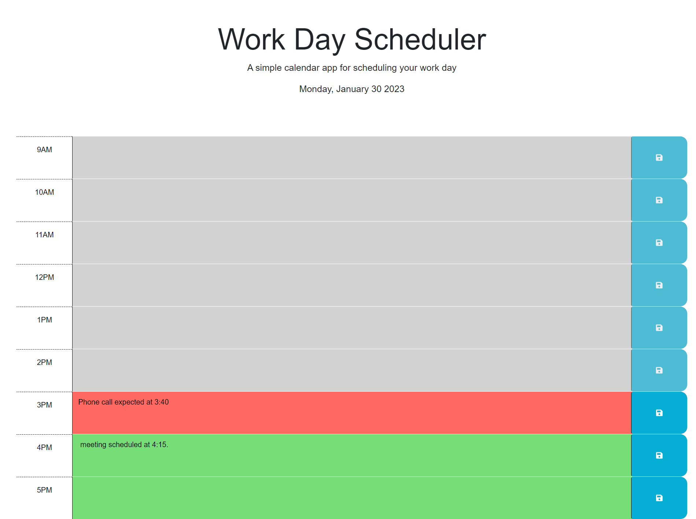

# Description
This website was made to allow a user to input events into a day planner during the workday and have those events saved.
# Usage
Upon loading the webpage the user is given a description of what the website does as well as the current day and date.  They are given areas that are blocks of time from 9am to 5pm.  the current hour is highlighted in red, future hours are highlighted in green, and past hours are grayed out. The user can enter text and save it in the present and future time blocks. That data is saved in local storage. If they change an event that will replace the old text with the new text. They cannot enter or save in the past time blocks. When the hour changes the page will update the future hour to present and the hour that was present will change to past.
# Screenshot

# Link to webpage
[my webpage](https://michaeloc1.github.io/module-5-DayPlanner)
